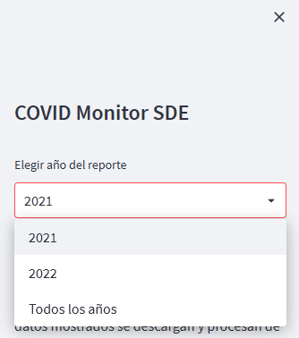

# COVID Monitor SDE
**Web app que recolecta datos de la pandemia COVID-19 en la provincia de Santiago del Estero (Argentina) y genera visualizaciones de seguimiento.**

*Read this in other languages:* [*README.en*](README.md) 

*Have you thought about learning spanish? It's the 4th most spoken language in the world, used by roughly 500 million people!*

## ¿Qué es?
`COVID Monitor SDE` es una *web app no oficial* que recolecta datos, mediante scraping, de los reportes diarios/semanales de la pandemia COVID-19 emitidos por el *Ministerio de Salud de Santiago del Estero* en su web oficial y los procesa para mostrar la evolución de testeos, contagios, recuperaciones y fallecimientos por semana, así como los totales acumulados y los máximos y mínimos por período.

## Instalación

`COVID Monitor SDE` está disponible en `streamlit cloud`. 
Para acceder [click aquí](https://gonzalezgbr-covid-monitor-sde-covidmonitorapp-hxmp74.streamlitapp.com/).

## Uso

La app muestra las métricas y gráficos en base al dataset generado y para el año seleccionado. 

Se puede cambiar el año del que se desea ver el reporte en la barra de la izquierda y los datos mostrados 
se actualizarán de forma dinámica. También hay una opción para ver "todos los años".

> ℹ️El reporte diario del MS comenzó a publicarse a partir de abril del 2021, por lo tanto en el análisis no se cuenta con datos previos a esa fecha. Por esta misma razón, los totales acumulados de todos los años no coincidirán con las fuentes oficiales ya que no incluyen los datos del año 2020 ni de los primeros meses de 2021.

## Tech stack

Este proyecto se desarrolló con `python`:
* `requests` para descargar la información de las páginas web
* `beatifulsoup4` y `re` para extraer los datos necesarios
* `pandas` para procesar el dataset y generar las stats
* `streamlit` y `millify` para mostrar los datos

## Fuentes de datos

Los datos utilizados en el análisis fueron descargados de [Ministerio de Salud de Santiago del Estero](https://msaludsgo.gov.ar/web/seccion/covid-19/reporte-diario/).

## Release History

* 0.1.1 
    * Minor style changes and translations
* 0.1.0 
    * First release

## Licencia

Este proyecto se distribuye bajo los términos de la licencia `Apache`.
Puedes ver la licencia completa [aquí](LICENSE).

## Feedback

¡Todo comentario y sugerencia es bienvenido! Puedes contactarme a través de [`twitter`](https://twitter.com/GargaraG) o [`linkedin`](https://www.linkedin.com/in/gonzalezgbr/). 

Gracias por visitar este proyecto ♥

---

**By GG** · [`github` @gonzalezgbr](https://github.com/gonzalezgbr/) · [`linkedin` @gonzalezgbr](https://www.linkedin.com/in/gonzalezgbr/) · [`twitter` @GargaraG](https://twitter.com/GargaraG) 
