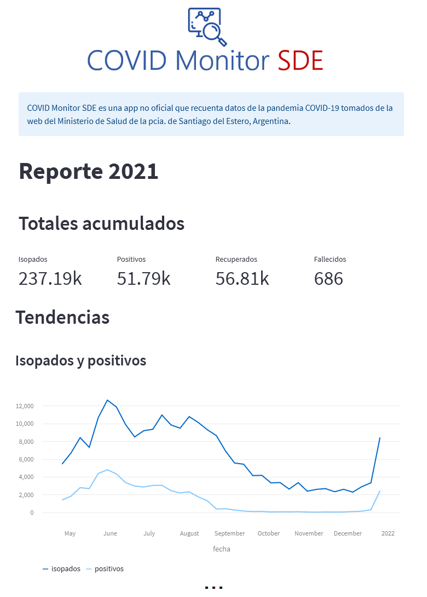
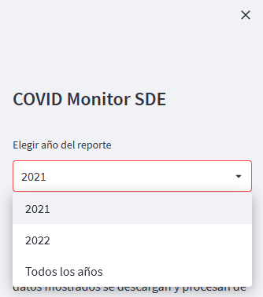

# COVID Monitor SDE
**Web app that collects data about the COVID-19 pandemic in the province of Santiago del Estero (Argentina) and generates summary visualizations.**

*Read this in other languages:* [*README.es*](README.es.md) 

## What is it?
`COVID Monitor SDE` it's an *unofficial web app* that scrapes data from the daily/weekly COVID-19 reports issued by the *Ministry of Health of Santiago del Estero* and posted in their official website. The data is then processed to show the evolution of testing, positive cases, recovered cases and deaths per week, as well as cumulative totals, and maximum and minimum values per period. 

## Installation

`COVID Monitor SDE` is deployed on `streamlit cloud`. 
[Click here](https://gonzalezgbr-covid-monitor-sde-covidmonitorapp-hxmp74.streamlitapp.com/) to access.

## Usage

The app shows the metrics and graphs based on the generated dataset, for the selected year.

You can change the year of the report in the left sidebar and the calculations and visualizations will be updated dinamycally. You can also choose the option *"todos los años"* (every year).

> ℹ️ The daily reports from the MH were posted in their website from april 2021 onwards, therefore the analysis does not include data from the previous periods. This is also why our cumulative totals for all years will not match the official sources of information (we don't have data from 2020 nor from the first months of 2021).

## Tech stack

This project was built with `python`:
* `requests` to download the information from web pages
* `beatifulsoup4` and `re` to extract the needed data
* `pandas` to process the dataset and calculate the stats
* `streamlit` and `millify` to show the data

## Data Sources

The data used was scraped from [Ministerio de Salud de Santiago del Estero](https://msaludsgo.gov.ar/web/seccion/covid-19/reporte-diario/).

## Release History

* 0.1.1 
    * Minor style changes
* 0.1.0 
    * First release

## License

This project is licensed under the terms of the `Apache` license.
You can check out the full license [here](LICENSE).

## Feedback

Any feedback is greatly appreciated! You can contact me via [`twitter`](https://twitter.com/GargaraG) or [`linkedin`](https://www.linkedin.com/in/gonzalezgbr/). 

Thanks for checking out this project ♥

---

**By GG** · [`github` @gonzalezgbr](https://github.com/gonzalezgbr/) · [`linkedin` @gonzalezgbr](https://www.linkedin.com/in/gonzalezgbr/) · [`twitter` @GargaraG](https://twitter.com/GargaraG) 

